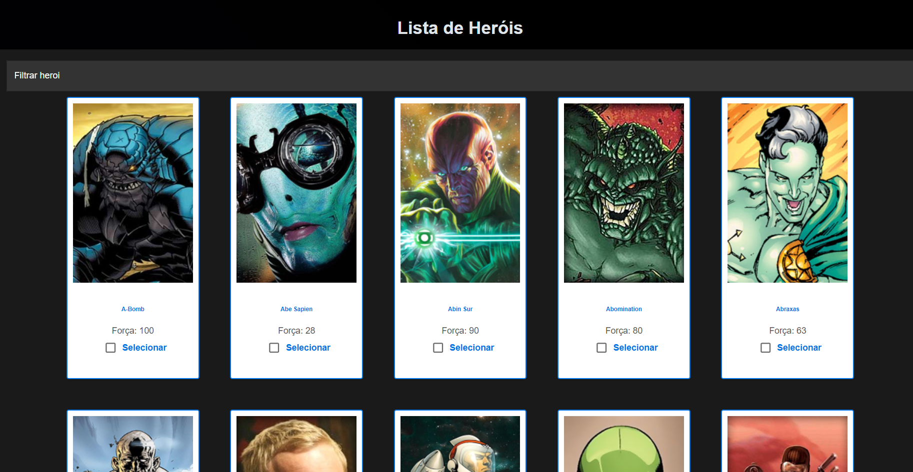

# TheHeroes 🦸‍♂️
## Descrição do Projeto
TheHeroes é uma aplicação que permite aos usuários explorar informações sobre super-heróis, incluindo seus nomes, poderes e imagens. A aplicação é construída em React.js com integração com uma API de super-heróis. Os usuários podem pesquisar por heróis, visualizar detalhes e até mesmo selecionar heróis para batalhas épicas!

  ## Funcionalidades Principais
- **Explorar Heróis**: Os usuários podem visualizar uma lista de super-heróis disponíveis.
- **Pesquisa de Heróis**: Os usuários podem pesquisar heróis específicos por nome.
- **Detalhes do Herói**: Ao clicar em um herói, os usuários podem visualizar detalhes, incluindo poderes e imagens.
- **Seleção de Heróis**: Os usuários podem selecionar até 2 heróis para batalhas.
- **Batalhas Épicas**: Os usuários podem iniciar batalhas entre os heróis selecionados e ver o resultado.
- **Estilização Atraente**: A aplicação é estilizada de forma atraente e chamativa para uma experiência visual agradável.

# 🚀 Como executar o projeto

```bash
 - Primeiro clone o repositório:
    - ``` git@github.com:Tiagoabranges/theheroes.git ```
 - Entre no repositório: 
   - ``` cd theheroes ```
   - ``` npm install ```
   - ``` npm run dev ```
````

# :books: Tecnologias Utilizadas

+ `ReactJS` Biblioteca JavaScript para construir interfaces de usuário interativas.
+ `HTML/CSS` Linguagens padrão da web para estruturar e estilizar a interface.
+ `Material UI` Biblioteca de componentes React para design de interface.
+ `Integração com API`: A aplicação se conecta a uma API de super-heróis para obter informações.
+ `React Router`: Para gerenciar a navegação entre as páginas.
+ `ESLint` Ferramenta para padronizar o estilo de código JavaScript.
+ `Prettier` Ferramenta para manter um estilo de código consistente e bem formatado.

  

#  :thumbsup: Contribuições
Contribuições são bem-vindas! Sinta-se à vontade para criar issues, pull requests ou sugerir melhorias para este projeto.

# 🐛 Encontrou um problema?
Se você encontrar algum problema, por favor me avise [aqui](https://www.linkedin.com/in/tiagoabranges/).


# 📝 Licença
Desenvolvido por [Tiago Abranges](https://www.linkedin.com/in/tiagoabranges/).

Contribuição
Contribuições são bem-vindas! Sinta-se à vontade para criar um fork do projeto e enviar pull requests



